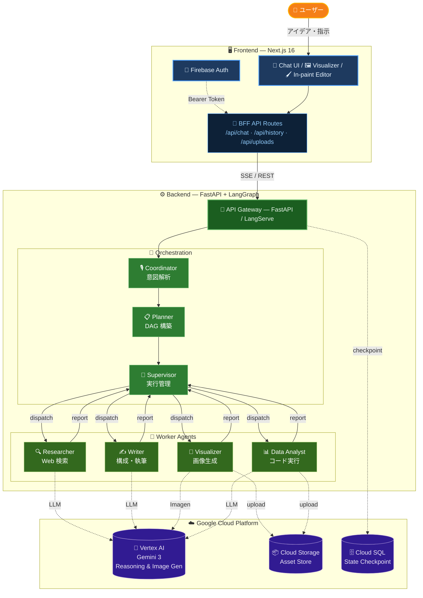

<p align="center">
  <h1 align="center">🎨 Sol LeWitt — AI Slide with Nano Banana</h1>
  <p align="center">
    <strong>「Hand for the Mind」— 想像力を形にする、AI マルチエージェント・ビジュアル生成システム</strong>
  </p>
</p>

<p align="center">
  
  
  
  
  
  
</p>

---

## 📖 概要

**Sol LeWitt** は、ユーザーの抽象的なアイデアやメモから、調査・構成案の作成・美しいビジュアルアセットの生成・最終成果物 (PPTX, デザイン, コミック) の統合までを **一気通貫で自動化** するインテリジェント・システムです。

複数の専門エージェントが **LangGraph ステートマシン** 上で協調して動作し、ユーザーは自分のアイデアに集中するだけで、プロフェッショナルなビジュアルコンテンツを手に入れることができます。

> 💡 **名前の由来**: Sol LeWitt（ソル・ルウィット）は、コンセプチュアル・アートの巨匠であり、「アイデアそのものが作品になる」という哲学を体現したアーティストです。本システムはその精神を AI で実現します。

## ✨ 主な特徴

| 特徴 | 説明 |
| :--- | :--- |
| 🤖 **マルチエージェント** | 7 つの専門ノード (Coordinator, Planner, Supervisor, Researcher, Writer, Visualizer, Data Analyst) が自律的に連携 |
| 🎨 **高品質な画像生成** | Gemini 3 Pro Image による一貫性のあるビジュアル生成と In-painting 編集 |
| 🔍 **Web リサーチ** | サブグラフ内での並列検索と、事実に裏打ちされたコンテンツ作成 |
| 🧠 **インテリジェント・リプランニング** | エラーや進捗状況に応じて Planner が動的に計画を修正 |
| ⚡ **リアルタイムストリーミング** | SSE + Vercel AI SDK による思考プロセス・進捗のライブ表示 |
| 🖌️ **In-paint 編集** | 生成画像の一部をブラシで指定して AI が部分修正 |
| 📊 **データ分析** | Python コード実行によるチャート生成とデータドリブンなスライド作成 |
| 🔒 **認証** | Firebase Authentication によるセキュアなユーザー管理 |

## 🏛️ システムアーキテクチャ



### コンポーネント一覧

| カテゴリ | 使用技術・サービス | 役割・特徴 |
| :--- | :--- | :--- |
| **Frontend Service** | Next.js 16 on Cloud Run | ユーザーが操作する画面 (チャット・スライドプレビュー・画像編集) と、バックエンドへリクエストを中継する BFF プロキシ |
| **認証** | Firebase Authentication | Google アカウントによるログイン。全 API リクエストに Bearer Token を付与しアクセスを保護 |
| **Backend Service** | FastAPI / LangServe on Cloud Run | フロントエンドからのリクエストを受け付け、AI ワークフローを起動。進捗を SSE でリアルタイム配信 |
| **LangGraph Workflow** | Coordinator → Planner → Supervisor | ユーザーの意図を解析し、タスクを自動分解、複数のワーカーに並列で割り振る司令塔 |
| | Researcher (Subgraph) | Web 上の情報を検索・収集し、コンテンツの裏付けとなるファクトを提供 |
| | Writer | 収集した情報をもとにスライドの構成案やテキストを執筆 |
| | Visualizer | テキストやデザイン指示から画像を生成。既存画像の部分修正 (In-painting) にも対応 |
| | Data Analyst | Python コードを実行してデータを分析し、チャートや最終 PPTX ファイルを生成 |
| **AI / ML** | Vertex AI (Gemini 3 Flash / Pro / Pro Image) | テキスト推論・高度な思考・画像生成を担う AI モデル群。タスクの難易度に応じて自動選択 |
| **Storage** | Cloud Storage (GCS) | 生成された画像や PPTX ファイルを保存・配信するオブジェクトストレージ |
| **Database** | Cloud SQL (PostgreSQL) | 会話の状態やワークフローの進捗を永続化し、中断・再開を可能にするチェックポイント DB |

## 📁 リポジトリ構造

```text
AI_Slide_with_nano_banana/
├── frontend/               # 🎨 Next.js フロントエンド
│   ├── src/
│   │   ├── app/            # App Router (ページ, BFF API Routes)
│   │   ├── features/       # 機能モジュール (chat, preview, auth)
│   │   ├── components/     # 共有 UI コンポーネント (Shadcn UI)
│   │   ├── providers/      # Auth / Theme プロバイダー
│   │   ├── hooks/          # 共有カスタムフック
│   │   └── lib/            # ユーティリティ
│   ├── tests/              # Vitest 単体テスト + Playwright E2E
│   └── apphosting.yaml     # Firebase App Hosting 設定
│
├── backend/                # ⚙️ Python バックエンド
│   ├── src/
│   │   ├── app/            # FastAPI アプリケーション
│   │   ├── core/           # LangGraph ワークフロー & ノード
│   │   ├── domain/         # ビジネスロジック (Designer)
│   │   ├── infrastructure/ # 外部連携 (Auth, LLM, Storage)
│   │   ├── shared/         # 共有 (Config, Schemas, Utils)
│   │   └── resources/      # プロンプトテンプレート
│   ├── scripts/            # DB 初期化, 運用スクリプト
│   ├── test/               # pytest テスト
│   ├── Dockerfile          # Cloud Run 用コンテナ
│   └── cloudbuild.yaml     # Cloud Build 定義
│
├── apphosting.yaml         # ルート App Hosting 設定
└── .gitignore
```

## 🚀 クイックスタート

### 前提条件

- **Node.js 20+** / **npm**
- **Python 3.12+** / **[uv](https://github.com/astral-sh/uv)**
- **Google Cloud SDK** (`gcloud auth application-default login` 済み)
- **PostgreSQL** (ローカルまたはリモート)

### 1. バックエンドの起動

```bash
cd backend
uv sync
cp .env.example .env
# .env に GCP プロジェクト情報と DB 接続文字列を設定

uv run python server.py
# → http://localhost:8000
```

### 2. フロントエンドの起動

```bash
cd frontend
npm install
cp .env.example .env.local
# .env.local に Firebase 設定を記入

npm run dev
# → http://localhost:3000
```

> **Note**: フロントエンドの `/api/*` リクエストは `next.config.ts` の rewrites によりバックエンド (`http://localhost:8000`) に自動プロキシされます。

詳細なセットアップ手順は各ディレクトリの README を参照してください:

- 📘 [Frontend README](./frontend/README.md)
- 📗 [Backend README](./backend/README.md)

## 🛠️ 技術スタック

### Frontend

| 技術 | バージョン | 用途 |
| :--- | :--- | :--- |
| Next.js | 16 | App Router, Standalone SSR |
| React | 19 | UI フレームワーク |
| TypeScript | 5.9 | 型安全 |
| Vercel AI SDK | 6 | AI ストリーミング統合 |
| Tailwind CSS | 4 | スタイリング |
| Shadcn UI / Radix UI | - | コンポーネントライブラリ |
| Zustand | 5 | 状態管理 |
| Framer Motion | 12 | アニメーション |
| Firebase | 12 | 認証 |

### Backend

| 技術 | バージョン | 用途 |
| :--- | :--- | :--- |
| Python | 3.12+ | ランタイム |
| FastAPI | 0.128+ | Web フレームワーク |
| LangGraph | 1.0+ | エージェント・オーケストレーション |
| LangChain | 1.2+ | LLM 抽象化レイヤー |
| Gemini 3 Flash | Preview | 推論・基本タスク |
| Gemini 3 Pro | Preview | 高度な推論 |
| Gemini 3 Pro Image | Preview | 画像生成・In-painting |
| PostgreSQL | - | チェックポイント永続化 |
| Google Cloud Storage | - | アセット保管 |
| Firebase Admin SDK | 6 | 認証トークン検証 |

### Infrastructure

| 技術 | 用途 |
| :--- | :--- |
| Firebase App Hosting | フロントエンド ホスティング |
| Cloud Run | バックエンド コンテナ実行 |
| Cloud Build | CI/CD パイプライン |
| Cloud SQL | PostgreSQL マネージドサービス |
| Cloud Storage | ファイル・アセット保管 |
| LangSmith | LLM トレーシング・オブザーバビリティ |

## 📚 ドキュメント

詳細な技術ドキュメントはそれぞれの `docs` ディレクトリにあります:

- 📘 [Frontend ドキュメント](./frontend/docs/README.md) — アーキテクチャ, 状態管理, AI 統合
- 📗 [Backend ドキュメント](./backend/docs/README.md) — システム概要, ワークフロー, ストリーミングプロトコル, API 仕様

## 📄 ライセンス

MIT License

---

© 2026 Sol LeWitt Project Authors.
