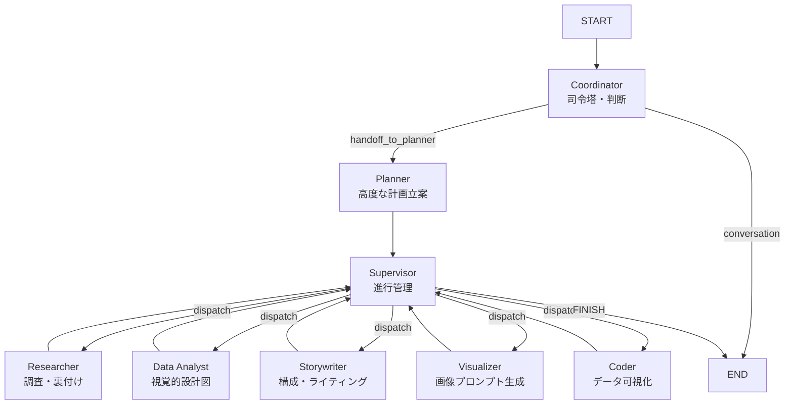

# AIスライド生成システム 要件定義書（確定版）

**文書バージョン:** 3.2 (Nano Banana Integration)
**対象モデル:**

* **Visual（画像生成）:** `Gemini 3.0 Pro Image` (Nano Banana Pro)
* **Logic/Vision:** `gemini-2.5-flash` (Reasoning Agent)
* **Data Analysis:** `gemini-2.5-flash` (Data Analyst Agent)

**ステータス:**
Plan-Driven Architecture (Coordinator, Planner, Researcher, Data Analyst, Storywriter, Visualizer) 実装完了・検証済み。
**"Visual Blueprinting"** によるデータ駆動型の作画計画、および **"Deep Edit"** による一貫性のある修正フローが実装されています。

---

## 1. 背景・目的

### 1.1 背景

ユーザーが保有するテキスト情報（プレゼン原稿やメモ）と、任意で提供されるデザイン資産（ロゴ画像、既存PPTX）をもとに、プレゼンテーション資料を自動生成するニーズが高まっている。
既存のツールは「テキストをPPTXオブジェクトに変換する」アプローチが主流だが、デザインの自由度が低く、手直しが発生しやすい。
本プロジェクトでは、**「全スライドを画像生成AIで一枚絵として描き出す」**アプローチにより、デザイン性の高いスライドを短時間で生成することを目指す。

### 1.2 目的

* **入力:** テキスト情報、ロゴ（任意）、スライドデザインPPTX（任意）
* **処理:** 画像生成AI（Nano Banana Pro）を用いたスライド画像の生成
* **出力:** 画像のみで構成されたPDF（1920×1080以上、16:9）
* **フェーズ:** プロトタイプ開発（技術検証およびUX検証）

---

## 2. ゴール / 非ゴール

### 2.1 ゴール（達成すべき状態）

1. **成果物:** 画像のみで構成されたPDFファイル。
2. **品質目標:** 「提出可能品質 95%」

   * デザイン：ロゴや参考PPTXのトーン＆マナーに沿って統一されていること。
   * 文字：**「読める（Legible）」**こと。Quality Gateにより文字崩れを最小化する。
3. **Grounding:** ユーザー入力を**補強**する形でのWeb参照を行う（上書きは禁止）。
4. **再生成:** ユーザーがスライド単位でプロンプトを入力し、自由に修正できること。

### 2.2 技術的制約と許容事項（プロトタイプ方針）

* **ロゴの再現性（A案採用）**

  * ロゴは画像生成モデルによる「描画」に任せる。
  * **許容事項:** ロゴの形状や文字が多少崩れたり、変形したりすることは許容する。正確な合成処理は行わず、「雰囲気の統一」を優先する。
* **ページ番号**

  * スライド画像内へのページ番号付与は行わない。
  * PDF化時の付与も本フェーズでは行わない。

### 2.3 非ゴール（対象外）

* メタデータの外部提供（生成履歴・詳細ログなど）
* 外部サービス連携（Google Drive, Slack, Notion等）
* セキュリティ/権利/監査/運用監視（SLA、アラート等）
* PPTX形式（編集可能なオブジェクト）での出力

---

## 3. 成果物仕様（出力）

* **ファイル形式:** PDF（画像結合ファイル）
* **構成:** スライド画像を順序通りに結合
* **ページ番号:** なし
* **画像解像度:** 1920×1080以上
* **アスペクト比:** 16:9
* **圧縮設定:** 品質優先（ファイルサイズ上限は規定しない）

---

## 4. 入力仕様

### 4.1 入力データ

1. **テキスト情報（必須）:** プレゼン内容・構成案
2. **ロゴ画像（任意）:** PNG / SVG形式

   * 用途：画像生成のプロンプト（参照）として利用
3. **スライドデザイン（任意）:** PPTX形式

   * 用途：デザインスタイル（色、背景、余白、レイアウト傾向）の抽出用
4. **参考資料（任意）:** PDF等

   * 用途：Planner / Grounding のコンテキスト入力として利用（要約・補強目的）

### 4.2 データの優先順位（信用ラベル）

* **ユーザー提供情報 ＝ 正（最上位）**
* Grounding（Web参照）結果とユーザー入力が矛盾する場合、**常にユーザー入力を優先**する（上書き禁止）

### 4.3 禁止入力

* なし（プロトタイプ段階ではフィルタリングを行わない）

---

## 5. 品質要件（95%定義）

### 5.1 可読性（Legibility）

* **基準:** 1920×1080の解像度において、本文が視認可能であること

  * 目安：24pt / 32px相当以上
* **判定:** 背景色と文字色のコントラストが確保されていること
* **制約:** 文字の**内容の正確性（誤字脱字、数字一致）**は評価対象外

  * 「文字として識別できる形をしているか」をQuality Gateで判定する

### 5.2 デザイン一貫性

* **フォント:** 「フォント風」の統一

  * 特定フォントファイルの指定ではなく、プロンプトで見た目を統一（例: “Clean Sans-serif”）
  * **生成のみで統一**（後段の文字合成は行わない）
* **テーマ:**

  * PPTXあり：抽出した特徴（色、背景、余白、レイアウト傾向）を継承
  * PPTXなし：デッキ全体で統一されたテーマを自動生成

### 5.3 デザインスタイル定義（Visualizer）

Visualizerが以下の要素を定義し、生成プロンプトに反映する。

* 色：主要色、アクセントカラー
* 背景：色、パターンの傾向
* 余白：マージン、要素間スペース感
* ロゴ位置：配置傾向
* タイトル/本文の領域比：構成比率
* レイアウト：代表的な**3パターン**（例：title/body/visual）
  **優先順位:** **色 ＞ 余白 ＞ レイアウト ＞ 装飾**

---

## 6. システムアーキテクチャ・ワークフロー (Ver 3.1 - Plan-Driven Architecture)

LangGraphを用いた「計画駆動型（Plan-Driven）」のステートフルなマルチエージェント・アーキテクチャを採用し、高品質なスライド生成を実現しています。

### 6.1 フロー概要



### 6.2 各ノードの役割

1.  **Coordinator (司令塔: Generative Gatekeeper)**
    *   ユーザーとの対話の入り口。厳格なゲートキーパーとして機能します。
    *   ユーザー入力を「雑談」「情報不足」「作成依頼」に分類し、必要な情報（ターゲット、目的等）が揃うまでPlannerへ引き継ぎを行いません。

2.  **Planner (計画立案: Master Strategist)**
    *   CoT (Chain-of-Thought) を用いて、オーディエンス分析とストーリーラインを設計します。
    *   「調査(Researcher) → 構成(Storywriter) → 視覚化(Visualizer)」という標準的かつ強力な3ステップの実行計画（`JSON Execution Plan`）を策定します。
    *   後続のエージェントに対し、**一貫した「トーン＆マナー」や「視覚コンセプト」を下達**します。

3.  **Supervisor (進行管理)**
    *   Plannerが作成した計画を厳密に遂行する決定論的（Deterministic）な管理者です。
    *   各ステップの完了を確認し、成果物をState（共有メモリ）に蓄積しながら次へ進めます。

4.  **Workers (専門実務部隊)**
    *   **Researcher:** Tavily等を活用し、スライドの信頼性を高めるための市場データ、統計、用語定義、引用句を収集し、レポート化します。
    *   **Data Analyst (New):** Researcherが集めた生データを分析し、最適なグラフ種類やインフォグラフィックの構造を決定する「視覚的設計図 (Visual Blueprint)」を出力します。
    *   **Storywriter:** 収集された情報を元に、**「1スライド1メッセージ」**の原則に従ってスライド構成案（タイトル＋箇条書き）を作成します。
    *   **Visualizer (Ver 2.0):** Gemini 3.0 Pro Imageのために最適化された「Context Injection」型プロンプトを生成します。役割・文脈・論理・スタイル・制約の5要素を注入し、高度な推論を画像生成に反映させます。また、**"Thinking Signature"** (Seed/Prompt履歴) を管理し、一貫性のある修正編集を実現します。
    *   **Coder:** 必要に応じてPython (Matplotlib/Plotly) で正確なチャートを描画します。

### 6.3 処理フロー詳細

#### Phase 1: Interaction & Planning (頭脳)
*   **Coordinator:** ユーザー意図の理解と振り分け。
*   **Planner:** 「何を」「どの順序で」行うかの戦略策定。

#### Phase 2: Execution & Output (手足・生成)
*   **Supervisor:** 動的なエージェント割り当て。
*   **Workers:** 調査、計算、生成の実実行。
    *   *Note:* スライド生成や画像生成などの特定タスクも、今後Workerとして統合または連携して実行されます。

### 6.4 Emotional Loading (UX連携)
バックエンドの処理ステップ（現在のノードや実行内容）をリアルタイムでフロントエンドに通知し、ユーザーに対し「AIが今何をしているか」を可視化することで、待ち時間のストレスを軽減します。

---

### 6.4 各ノードの役割
... (省略) ...

---

## 7. Project Structure

本プロジェクトは、フロントエンド（Next.js）とバックエンド（FastAPI / LangGraph）のモノレポ構成です。

```
.
├── backend/              # バックエンド (Python / FastAPI / LangGraph)
│   ├── langgraph/        # エージェント・オーケストレーション
│   └── docs/             # データベース設計・APIドキュメント
├── frontend/             # フロントエンド (Next.js / TypeScript)
│   ├── src/
│   │   ├── app/          # App Router (Routes & Layouts)
│   │   ├── components/   # 共通UIコンポーネント
│   │   └── features/     # 機能単位のカプセル化 (Chat, Preview)
│   └── test/             # PlaywrightによるE2Eテスト
└── checklist/            # プロトコル・API検証用スクリプト
```

---

## 8. UXコンセプト（追加）

### 7.1 UXコンセプト：Dual-Pane "Co-Creation" Workspace
従来の「指示して待つ」だけの関係から、**「AIと共に作り込む」体験へ昇華させる。** 全生成の試行錯誤（ガチャ）を減らし、気に入ったベースデザインを維持しながら細部を詰める**「Precision Edit」**と、待ち時間を体験に変える**「Emotional Loading」**を中核に捉える。

画面を左右に分割した**デュアルペイン構造**を採用し、左側で**思考と指示（Chat）**、右側で**具現化と確認（Preview）**を同時に行う。
「AIが考える → 形になる → その場で直す」を往復し、生成AIの“試行回数”をUXで吸収する。

#### 7.1.1 左側：インタラクティブ・チャット（Input & Logic）

* **マルチモーダル入力:** テキスト入力に加え、ロゴ画像・参考PPTX・PDF資料をドラッグ＆ドロップで添付可能。
* **プログレス・フィードバック:** 生成中、AIが現在何をしているか（例：「構成案を作成中…」「スタイルを抽出中…」）をチャットバブル／ステータスでリアルタイム表示。
* **サジェスト機能:** 生成完了後、「Sourcesスライドを追加して」「全体をもっとモダンな色味にして」等の次アクションをボタン形式で提示。

#### 7.1.2 右側：ライブ・プレビュー（Output & Visualization）

* **スケルトン・ローディング:** 画像生成完了前から、スライド枠や構成（テキストのみ/簡易）を先に表示し期待値を調整。
* **スライド・カルーセル/リスト:** 全体を俯瞰できる一覧（サムネ）と、単枚の拡大表示をシームレスに切り替え。
* **生成プロセス可視化:** Nano Banana Pro が描画していく過程を段階的に表示（生成中であることを“見える化”）。


### 7.2 機能要件詳細（New）


#### 7.2.2 Emotional Loading（思考プロセスの演出）
生成待ち時間（数分）の離脱を防ぎ、ユーザーに「AIが自分のために働いている」という安心感（Agency）を与えるための演出。

*   **目的:** ブラックボックスな待ち時間を「可視化されたプロセス」に変え、体感待ち時間を短縮する。
*   **UI表示:** チャット画面またはステータスエリアに、AIの「独り言（思考ログ）」を流れるように表示する。機械的なプログレスバーではなく、人間味のある自然言語で表示する。
*   **技術挙動:**
    *   モデル: `gemini-2.5-flash-001` (Logic)
    *   処理: メインの画像生成処理とは別に**並列（非同期）**で実行。現在のシステム処理状態（Step）を入力とし、ユーザー向けの「演出テキスト」をリアルタイム生成して表示する。

### 7.3 ユーザーフロー（UXステップ）


1. **起動（入力）**

   * ユーザー：テーマや資料を入力
   * UX：入力エリアが中央→左へスライドし、右側に空のプレビューが出現
2. **構成合意（アウトライン確認）**

   * ユーザー：AIが提案する構成案を確認・修正指示
   * UX：右側に「アウトライン（目次）」表示、チャットで過不足を調整
3. **スタイル確定（デザイン提案）**

   * ユーザー：添付ロゴ/PPTXによるスタイル提案を確認
   * UX：右側に1枚目のデザインサンプル（初稿）を表示
4. **本生成（スライド生成）**

   * ユーザー：生成開始
   * UX：左側でAIが意図を解説しつつ、右側で順次画像が描画される
5. **修正・出力（再生成→PDF）**

   * ユーザー：プレビューから対象スライドを選び指示
   * UX：即座に再生成→差し替え、完了後PDFをエクスポート

### 7.3 インタラクション詳細（Genspark/Orcha流）

#### 7.3.1 スライド単位のコンテキスト操作

* プレビューでスライドをクリックすると、チャットの入力コンテキストがそのスライドに自動フォーカス
* 例：3枚目を選択して「この図解をもう少しシンプルにして」と打つだけで、AIは `slide_id=3` への指示として扱う

#### 7.3.2 「AI Edit」と「Manual Review」の統合（ツールバー）

* 各スライド上部にツールバーを配置（例：`[Fact check content] [AI Edit] [Advanced Edit]`）

  * **Fact check content:** Grounding機能でスライド内の数字・事実の妥当性を再確認（任意操作）
  * **AI Edit:** 「トーンを明るく」「情報を半分に減らして」等のクイック編集メニュー

### 7.4 画面レイアウト（ワイヤフレーム構成）

* **Header:** プロジェクト名、共有（Share）、保存状態、View & Exportボタン
* **Left Pane (Chat & Logic):**
  * 指示入力、履歴表示に加え、**「AIの思考ログ」**が流れるタイムライン。
* **Right Pane (Preview & Edit):**
  * 生成されたスライドのプレビュー。
  * 生成されたスライドのプレビュー。

---

## 8. Quality Gate 要件（確定）

### 8.1 判定ロジック

`gemini-2.5-flash-001`（Vision）による「擬似OCR」で二値判定。

* **対象:** `text_expected = true` のスライドのみ
* **入力:** スライド画像（PNG/JPEG）
* **出力:** OK / NG（理由表示は不要。内部ログは任意）

### 8.2 判定閾値（確定）

以下の条件をすべて満たす場合のみ OK とする。

1. **R1 (Block Count):** 検出されたテキストブロック数 `>= 1`
2. **R2 (Confidence):** 平均信頼度 `>= 0.85`
3. **R3 (Illegible):** 判読不能ブロック数 `<= 1`

### 8.5 スタイル一貫性チェック（Ultrathinking）

* **対象:** 全生成スライド（PDF化直前）
* **入力:** 全スライド画像群 + `global_prompt`
* **処理:** Gemini 2.5 Flashで全体の一貫性（色使い、フォント、抽象度）を0-100点評価
* **NG時の挙動:** 警告ログを出力し、PDFの最終ページに「Style Consistency Issue」レポートを添付する（または今回はログのみ）。

### 8.3 文字ゼロスライドの扱い（確定）

* `text_expected=false` のスライドは **Quality GateをスキップしOK扱い**とする

### 8.4 NG時の挙動（確定）

* **自動再生成:** 最大 **N=2回**

* **改善策:** 再生成プロンプトに可読性向上指示（例: “high contrast text, simple background”）を自動追加 **[Ultrathinking: NG理由に応じた動的指示出し機能を含む]**
* **フォールバック:** N回失敗した場合、NG画像のまま採用し、ユーザーの手動再生成に委ねる（無限ループ防止）

---

## 9. 機能要件

### 9.1 生成機能

* 入力からスライド一式（既定10枚または指定枚数）を生成
* Visualizer と Planner の連携により、デザインと構成の整合性を担保する

### 9.2 再生成機能

* **単位:** スライドID指定による単枚再生成（Refinement Mode）
* **入力:** ユーザーによる修正プロンプト（例：「もっと明るい色にして」「グラフを棒グラフに変更して」）
* **Deep Edit (New):**
    *   **Thinking Signature:** 過去の生成時のSeedとPrompt履歴を引き継ぎ、変更点以外の一貫性を保持する。
    *   **Reference Anchor:** アスペクト比修正（16:9強制）や特定のビジュアル要素を固定するための参照画像を自動適用する。

### 9.3 Sourcesスライド生成（確定）

* **Groundingを実行した場合のみ**、末尾に Sources スライド（画像）を追加する
* Grounding未実行の場合は Sources スライドは生成しない
* **Status:** Verified (Google Search Tool integration works)

---

## 10. 非機能要件

### 10.1 性能

* **生成時間:** 10枚規模のデッキで数分以内（並列生成を推奨）
* **同時実行:** プロトタイプ段階では考慮しないが、内部設計はStateless志向とする

### 10.2 信頼性

* 生成APIエラー時のリトライ処理（最大2回）
* Quality Gateループ（最大2回）による文字崩れ低減

### 10.3 拡張性

* 将来的なPPTX出力（オブジェクト配置）を見据え、内部データ（`SlidePlan`）はテキストと画像生成指示を構造化して保持できる設計とする（ただし外部提供はしない）

---

## 11. 画面・UX（最小要件）

※本章は7章（UXコンセプト）を満たすための「最小実装要件」を示す。

1. **Input画面（Dual-Pane起動前）**

   * テキスト入力、ファイルアップロード（ロゴ/PPTX/PDF）、生成ボタン
2. **Dual-Pane Workspace画面**

   * 左：チャット（進捗・指示・サジェスト）
   * 右：プレビュー（スケルトン→画像、一覧↔拡大、段階表示）
3. **再生成UI**

   * スライド選択→チャットが当該 `slide_id` にフォーカス
   * 再生成ボタン／AI Editメニュー
4. **Export**

   * PDFダウンロードボタン（View & Export）

---

## 12. 未決・調整パラメータ（テストで調整）

* Quality Gateの閾値（`0.85`）の妥当性検証（必要なら調整）
* Style Extractor が出力する `global_prompt` のチューニング
* 再生成時の「可読性向上指示」の強度（入れ過ぎるとデザインが単調になるため）
* 代表レイアウト3パターンの抽出・分類ルールの調整（PPTXの多様性に応じて）

---

## 13. デザインガイドライン (Visual Design)

* **モノクローム基調:** 白、グレー、黒をベースとした「クリーン、ミニマル、タイムレス」な配色を採用しています。コンテンツ（生成物）が主役となるよう、UI自体の主張は抑えられています。

* **モダンなサンセリフ体:** 可読性の高い、現代的なゴシック系フォント（サンセリフ）が使用され、情報の整理がなされています。

### 13.1 レイアウト構成

* **2ペイン（分割）構成:**
  チャット/指示エリア（左側）とワークスペース/プレビューエリア（右側）の分割表示を採用し、対話と生成結果の確認をシームレスに行えるようにしています。
