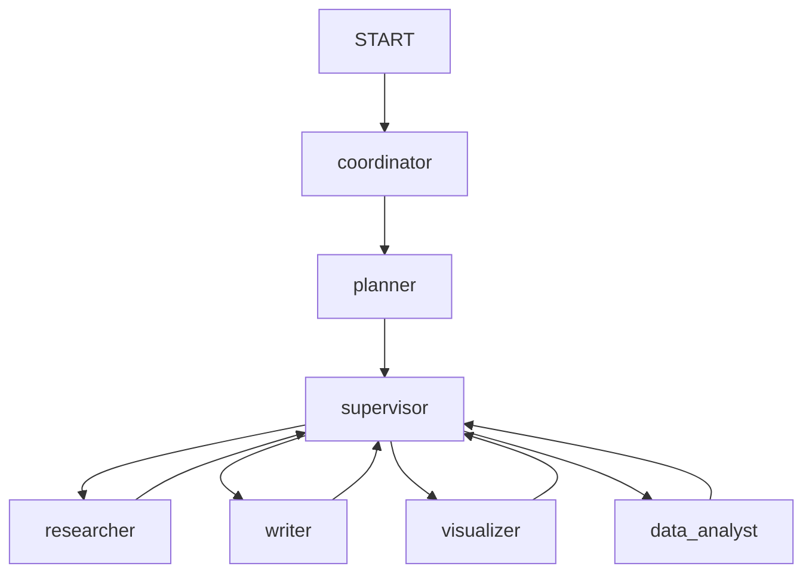

# Sol LeWitt Backend


**Sol LeWitt Backend** は **AI Slide with Nano Banana** プロジェクトのためのインテリジェントなバックエンドエンジンです。**LangGraph** を活用してマルチエージェントワークフローをオーケストレーションし、ユーザーのプロンプトに基づいてリサーチ、構成作成、スライドデザイン、レンダリング (PPTX 生成) を自律的に実行します。

## 🌟 主な機能

- **マルチエージェント・オーケストレーション**: LangGraph StateGraph を使用し、7 つの専門ノードを協調動作させるワークフローエンジン。
- **AI 駆動ワークフロー**:
  - **Coordinator**: ユーザーの意図を解析し、適切なフローにルーティング。フォローアップ質問の生成。
  - **Planner**: タスクを DAG 構造で分解し、各ステップの依存関係を定義。動的リプランニング対応。
  - **Supervisor**: 並列タスクの実行管理とワーカーへのディスパッチ。
  - **Researcher**: Web 検索を実行し、サブグラフ内で並列リサーチタスクを処理。
  - **Writer**: 構成案に基づき、スライドのアウトラインやコンテンツを執筆。Self-Critique 内蔵。
  - **Visualizer**: Google Vertex AI (Gemini 3 Pro Image) を使用した画像生成・In-painting。並行処理対応。
  - **Data Analyst**: Python コード実行によるデータ分析、チャート生成、PPTX レンダリング。
- **プロダクト・タイプ**: `slide`（スライド）、`design`（デザイン）、`comic`（コミック）の 3 形式をサポート。
- **永続的なステート管理**: **PostgreSQL** ベースの LangGraph チェックポイントで、スレッドごとの会話状態を永続化。
- **SSE ストリーミング**: カスタム `stream_events` エンドポイントによるリアルタイムイベント配信。
- **クラウドネイティブ**: GCP (Vertex AI, Cloud Storage, Cloud SQL, Cloud Run) + Firebase Auth とシームレスに統合。

## 🏗️ アーキテクチャ

DDD (ドメイン駆動設計) に影響を受けたレイヤードアーキテクチャを採用しています。

```text
backend/
├── server.py              # ローカル開発用エントリーポイント (Uvicorn)
├── main.py                # CLI エントリーポイント (グラフの直接実行・テスト用)
├── Dockerfile             # Cloud Run デプロイ用 (LibreOffice, Poppler 同梱)
├── cloudbuild.yaml        # Cloud Build → Cloud Run デプロイ定義
├── scripts/               # 運用スクリプト
│   ├── init_db.py         # DB テーブル初期化
│   └── ...
└── src/
    ├── app/               # インターフェース層 (FastAPI)
    │   └── app.py         # アプリケーション本体 (ルーティング, ミドルウェア, 全 API エンドポイント)
    ├── core/              # アプリケーションコア
    │   ├── workflow/      # LangGraph ステートマシン
    │   │   ├── builder.py # グラフ構築 (ノード登録 & エッジ定義)
    │   │   ├── state.py   # State TypedDict (Plan, Artifacts, Orchestration)
    │   │   ├── service.py # ワークフローサービス
    │   │   ├── step_v2.py # ステップ実行ロジック
    │   │   └── nodes/     # 各ノードの実装
    │   │       ├── coordinator.py
    │   │       ├── planner.py
    │   │       ├── supervisor.py
    │   │       ├── researcher.py   # サブグラフ (並列リサーチ)
    │   │       ├── writer.py
    │   │       ├── visualizer.py
    │   │       ├── data_analyst.py
    │   │       └── common.py       # 共通ユーティリティ
    │   └── tools/         # エージェントが使用するツール
    ├── domain/            # ビジネスロジック
    │   └── designer/      # 画像生成・In-painting ロジック
    ├── infrastructure/    # インフラストラクチャ & 外部インターフェース
    │   ├── auth/          # Firebase Authentication 検証
    │   ├── llm/           # Gemini モデル設定・レート制限管理
    │   └── storage/       # GCS ファイル操作
    ├── shared/            # 共有カーネル
    │   ├── config/        # Pydantic Settings (環境変数一元管理)
    │   ├── schemas/       # 入出力スキーマ定義
    │   └── utils/         # 共通ユーティリティ
    └── resources/         # プロンプトテンプレート等のリソースファイル
```

### ワークフローグラフ



## 🚀 はじめに

### 前提条件

- **Python 3.12+**
- **[uv](https://github.com/astral-sh/uv)**: 高速な Python パッケージマネージャー
- **Google Cloud SDK**: `gcloud auth application-default login` で認証済み
- **PostgreSQL**: ローカルまたは Cloud SQL (チェックポイント用)

### インストール

1.  **依存関係のインストール:**
    ```bash
    cd backend
    uv sync
    ```

2.  **環境設定:**
    ```bash
    cp .env.example .env
    ```

    **必須の環境変数:**

    | 変数名 | 説明 |
    | :--- | :--- |
    | `VERTEX_PROJECT_ID` | GCP プロジェクト ID |
    | `VERTEX_LOCATION` | Vertex AI リージョン (例: `asia-northeast1`, `global`) |
    | `POSTGRES_DB_URI` | PostgreSQL 接続文字列 |
    | `GCS_BUCKET_NAME` | 生成アセットを保存する GCS バケット名 |

    **LLM モデル設定:**

    | 変数名 | デフォルト | 説明 |
    | :--- | :--- | :--- |
    | `BASIC_MODEL` | - | シンプルなタスク用 (例: `gemini-3-flash-preview`) |
    | `REASONING_MODEL` | - | 推論タスク用 (例: `gemini-3-flash-preview`) |
    | `HIGH_REASONING_MODEL` | - | 高度な推論用 (例: `gemini-3-pro-preview`) |
    | `VL_MODEL` | - | 画像理解・生成用 (例: `gemini-3-pro-image-preview`) |

    **その他の主要設定:**

    | 変数名 | デフォルト | 説明 |
    | :--- | :--- | :--- |
    | `FIREBASE_SERVICE_ACCOUNT_JSON` | - | Firebase サービスアカウント JSON |
    | `MAX_RETRIES` | `3` | ワーカーのリトライ回数 |
    | `VISUALIZER_CONCURRENCY` | `5` | 画像生成の並列度 |
    | `RESEARCHER_CONCURRENCY` | `3` | リサーチの並列度 |
    | `RECURSION_LIMIT_WORKFLOW` | `50` | ワークフロー再帰上限 |
    | `RECURSION_LIMIT_RESEARCHER` | `7` | リサーチサブグラフ再帰上限 |

### サーバーの起動

```bash
# ホットリロード付きで起動
uv run python server.py

# または直接 uvicorn で起動
uv run uvicorn src.app.app:app --reload --port 8000
```

API サーバーが `http://localhost:8000` で起動します。

### CLI でのテスト実行

API 層を介さずにワークフローを直接実行:

```bash
uv run python main.py   # Mermaid グラフを出力
```

## 📡 API エンドポイント

サーバー起動後、インタラクティブな API ドキュメントにアクセスできます:

- **Swagger UI**: [http://localhost:8000/docs](http://localhost:8000/docs)
- **ReDoc**: [http://localhost:8000/redoc](http://localhost:8000/redoc)

### 主要エンドポイント一覧

| Method | Path | 概要 |
| :--- | :--- | :--- |
| `POST` | `/api/chat/stream_events` | LangGraph ワークフロー実行 (SSE ストリーミング) |
| `GET` | `/api/history` | ユーザーのスレッド一覧取得 |
| `GET` | `/api/history/{thread_id}/snapshot` | スレッドの UI スナップショット取得 |
| `POST` | `/api/files/upload` | 画像・PPTX ファイルアップロード |
| `POST` | `/api/inpaint/{image_id}` | 画像の In-painting 編集 |
| `POST` | `/api/inpaint/deck/{deck_id}/slide/{slide_number}` | スライドデッキの In-painting |
| `GET` | `/health` | ヘルスチェック |

### LangServe 互換エンドポイント

LangServe により自動生成される標準エンドポイントも利用可能です:

| Method | Path | 概要 |
| :--- | :--- | :--- |
| `POST` | `/api/chat/invoke` | 同期的なワークフロー呼び出し |
| `POST` | `/api/chat/stream` | LangServe 標準ストリーミング |

## 🧪 テスト

```bash
# テストスイートの実行 (カバレッジ付き)
uv run pytest

# 特定のテストファイルを実行
uv run pytest test/test_specific.py -v
```

テスト設定は `pyproject.toml` の `[tool.pytest.ini_options]` で管理されています。

## 🚢 デプロイ

### Cloud Run (Docker)

本番環境は **Google Cloud Run** にデプロイされます。

```bash
# Cloud Build 経由でデプロイ
gcloud builds submit --config=cloudbuild.yaml
```

**Dockerfile の特徴:**
- `python:3.12-slim-bookworm` ベース
- **LibreOffice** (PPTX → PDF 変換用)
- **Poppler** (PDF → PNG 変換用)
- **Noto CJK フォント** (日本語表示対応)
- 非 root ユーザー実行 (セキュリティ)
- 起動時に `scripts/init_db.py` で DB テーブル自動初期化

**Cloud Run 設定 (cloudbuild.yaml):**
- リージョン: `asia-northeast1`
- メモリ: 4Gi / CPU: 4
- タイムアウト: 3600 秒
- Cloud SQL 接続 (Unix Domain Socket 自動切替)

## 🛠️ 技術スタック

| カテゴリ | 技術 |
| :--- | :--- |
| **Web Framework** | FastAPI, LangServe |
| **Agent Orchestration** | LangGraph (StateGraph) |
| **AI Models** | Google Gemini 3 (Flash, Pro, Pro Image) via Vertex AI |
| **AI Libraries** | LangChain, LangChain Google VertexAI / GenAI, google-genai |
| **Database** | PostgreSQL (`psycopg`, `langgraph-checkpoint-postgres`) |
| **Storage** | Google Cloud Storage |
| **Auth** | Firebase Admin SDK |
| **Document** | python-pptx, pdf2image, Pillow, LibreOffice |
| **Config** | Pydantic Settings, python-dotenv |
| **Web Scraping** | httpx, readabilipy, markdownify |
| **Testing** | pytest, pytest-asyncio, pytest-cov |
| **Code Style** | Black |
| **Package Manager** | uv (hatchling build backend) |
| **Deployment** | Docker, Cloud Build, Cloud Run |
| **Observability** | LangSmith (LANGCHAIN_TRACING_V2) |
