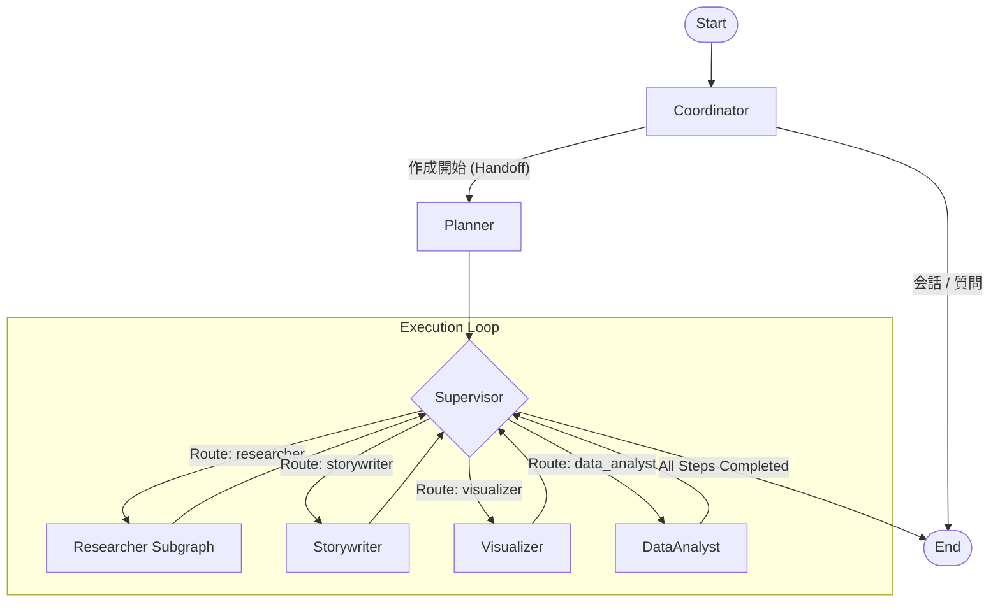
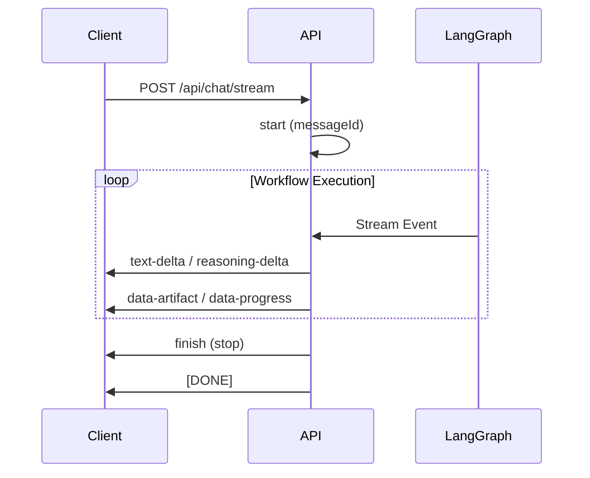

# システムアーキテクチャ

本ドキュメントでは、**Spell** AIスライド生成システムのアーキテクチャについて解説します。
本システムは [LangGraph](https://langchain-ai.github.io/langgraph/) 上に構築されており、**Supervisor-Worker（監督者-作業者）** パターンと**Hierarchical Agent（階層型エージェント）** 構造を採用しています。

---

## 1. デザインパターンとアーキテクチャ概要

ユーザーの抽象的なリクエスト（例：「日本の経済についてのスライドを作って」）を、具体的なスライドデッキ（最終成果物）に変換するため、複数の専門エージェントが協調して動作します。

システムの中心となるのは **LangGraph** によるステートフルなグラフ実行です。

### 主な特徴

*   **Supervisor-Worker 構成**: `Supervisor` ノードが中心となり、計画に基づいて各 `Worker`（専門エージェント）にタスクを割り振ります。
*   **Researcher Subgraph**: 調査タスクは単一のノードではなく、独立した子グラフ（Subgraph）として実装されており、複雑な調査プロセス（検索→評価→集約）をカプセル化しています。
*   **Self-Correction**: 以前存在した独立した `Reviewer` ノードは廃止され、各 Worker が自己批評（Self-Critique）や構造化出力による検証を行う設計に移行しました。
*   **Artifact-Centric**: 各ステップの出力は「アーティファクト」として保持され、後続のノードやフロントエンドで参照されます。

---

## 2. エージェントの役割（Nodes）

| ノード名 | 役割 | 責務 |
| :--- | :--- | :--- |
| **Coordinator** | エントリーポイント | ユーザーとの対話を担当。曖昧なリクエストの場合は質問を返し、明確な場合に `Planner` へ制御を移します（ハンドオフ）。 |
| **Planner** | 計画立案 | ユーザーの目的を達成するための具体的なステップ（`Plan`）を作成します。各ステップには担当Workerと指示が含まれます。 |
| **Supervisor** | オーケストレーター | `Plan` の進捗状況を管理します。未完了のステップがあれば適切な `Worker` を呼び出し、全ステップ完了時にフローを終了させます。 |
| **Storywriter** | スライド構成作家 | スライドのアウトラインや本文テキストを作成します。 |
| **Visualizer** | ビジュアル生成 | スライド用の画像プロンプトを作成し、画像生成AI（Vertex AI / Gemini）を呼び出して画像を生成します。PPTXテンプレートに基づくスタイル制御も担当します。 |
| **Data Analyst** | データ分析 | コード実行環境（Python REPL）を持ち、データの計算やグラフの設計図を作成します。 |
| **Researcher** | 調査（Subgraph） | Google Search (GenAI Native Grounding) を行い、信頼性の高い情報を収集・整理します。内部で独自のサイクルを持ちます。 |

---

## 3. データフロー

システムは以下のフェーズで進行します。

1.  **Initialization (Coordinator)**
    *   ユーザー入力を受け取り、対話履歴を管理。
    *   スライド作成が必要と判断した場合、`Planner` を呼び出す。

2.  **Planning (Planner)**
    *   要件に基づき、タスクリスト（`Plan`）を生成。
    *   例: `[ {role: researcher, ...}, {role: storywriter, ...}, {role: visualizer, ...} ]`

3.  **Execution Loop (Supervisor <-> Workers)**
    *   `Supervisor` がプランを確認し、次に実行すべきステップ（`status: pending`）を特定。
    *   担当の `Worker`（例: `Storywriter`）を呼び出す。
    *   `Worker` はタスクを実行し、結果（`Result Summary`）と成果物（`Artifact`）を生成して `Supervisor` に戻る。
    *   `Supervisor` は該当ステップを `completed` に更新し、次のステップへ。

4.  **Completion**
    *   全ステップが完了すると、処理を終了しユーザーに完了を通知。

### Mermaid ダイアグラム



---

## 4. AI/LLM統合アーキテクチャ

### 4.1 LLMファクトリパターン

`src/agents/llm.py` で定義されるファクトリパターンにより、モデルタイプに応じたLLMインスタンスを取得します。

```python
# LLMタイプ → モデル取得
llm = get_llm_by_type("reasoning")  # gemini-2.0-flash-thinking-exp-1219
llm = get_llm_by_type("basic")      # gemini-1.5-flash-002
llm = get_llm_by_type("vision")     # gemini-3-pro-image-preview
```

### 4.2 モデルタイプ分類

| タイプ | 用途 | デフォルトモデル |
| :--- | :--- | :--- |
| `reasoning` | 複雑な推論タスク（Planner, Researcher） | `gemini-2.0-flash-thinking-exp-1219` |
| `basic` | シンプルなタスク（Coordinator） | `gemini-1.5-flash-002` |
| `vision` | 画像生成・理解タスク（Visualizer） | `gemini-3-pro-image-preview` |
| `high_reasoning` | 高度な推論タスク | `gemini-2.0-flash-thinking-exp-1219` |

### 4.3 認証フロー

1. **Vertex AI 優先**: `VERTEX_PROJECT_ID` が設定されている場合、Application Default Credentials (ADC) を使用
2. **AI Studio フォールバック**: API キーが設定されている場合、Google AI Studio 経由でアクセス

```python
# Vertex AI モード
if settings.VERTEX_PROJECT_ID:
    return create_gemini_llm(
        model=model,
        api_key=None,  # ADC使用
        project=settings.VERTEX_PROJECT_ID,
        location=settings.VERTEX_LOCATION or "asia-northeast1"
    )
```

### 4.4 エージェント別LLMマッピング

| エージェント | LLMタイプ |
| :--- | :--- |
| coordinator | basic |
| planner | reasoning |
| researcher | reasoning |
| storywriter | basic |
| visualizer | vision |
| data_analyst | reasoning |

---

## 5. 構造化出力（Controlled Generation）

各Workerは LLM からの応答を厳密に型定義された JSON（Pydanticモデル）として受け取ります。
LangChain の `with_structured_output` を使用し、Gemini の Controlled Generation 機能を活用しています。

### 5.1 実装パターン

```python
from src.schemas import StorywriterOutput

llm = get_llm_by_type(AGENT_LLM_MAP["storywriter"])
structured_llm = llm.with_structured_output(StorywriterOutput)

# Pydanticオブジェクトが直接返される
result: StorywriterOutput = structured_llm.invoke(messages)
```

### 5.2 主要スキーマ一覧

| スキーマ | 用途 | 定義場所 |
| :--- | :--- | :--- |
| `PlannerOutput` | 実行計画 | `src/schemas/outputs.py` |
| `StorywriterOutput` | スライドコンテンツ | `src/schemas/outputs.py` |
| `VisualizerOutput` | 画像生成プロンプト | `src/schemas/outputs.py` |
| `DataAnalystOutput` | データ分析結果 | `src/schemas/outputs.py` |
| `ResearchTaskList` | 調査タスク分解 | `src/schemas/outputs.py` |
| `DesignContext` | テンプレートデザイン情報 | `src/schemas/design.py` |

---

## 6. Native Grounding（Google検索統合）

Researcher ノードは Gemini の Native Grounding 機能を使用して、Google 検索を LLM に直接統合しています。

### 6.1 実装

```python
llm = get_llm_by_type("reasoning")
grounding_tool = {'google_search': {}}
llm_with_search = llm.bind(
    tools=[grounding_tool],
    generation_config={"response_modalities": ["TEXT"]}
)

response = llm_with_search.invoke(messages)
```

### 6.2 特徴

*   外部 API 呼び出し不要（LLM 内部で検索実行）
*   引用元情報が自動的にレスポンスに含まれる
*   最新情報へのアクセスが可能

---

## 7. 画像生成アーキテクチャ

### 7.1 google-genai SDK 直接使用

画像生成には LangChain を経由せず、`google-genai` SDK を直接使用します。
これにより、マルチモーダル入力や ThoughtSignature などの高度な機能を活用できます。

```python
from google import genai
from google.genai import types

client = genai.Client(
    vertexai=True,
    project=settings.VERTEX_PROJECT_ID,
    location=settings.VERTEX_LOCATION
)

response = client.models.generate_content(
    model=settings.VL_MODEL,
    contents=contents,
    config=types.GenerateContentConfig(
        response_modalities=["IMAGE"],
        seed=seed
    )
)
```

### 7.2 画像生成戦略

| 戦略 | 説明 | 使用条件 |
| :--- | :--- | :--- |
| **Strategy T (Template)** | レイアウト別テンプレート画像を参照 | `DesignContext` が存在する場合 |
| **Sequential Chat** | Chat session でコンテキスト引き継ぎ | テンプレートがない場合 |

### 7.3 構造化プロンプト（StructuredImagePrompt）

Markdownベースのスライド画像生成プロンプト形式を採用：

```python
class StructuredImagePrompt(BaseModel):
    slide_type: str       # "Title Slide", "Content", etc.
    main_title: str       # メインタイトル
    sub_title: str | None # サブタイトル
    contents: str | None  # 本文コンテンツ
    visual_style: str     # ビジュアルスタイル（英語）
```

コンパイル後の形式：
```
# Slide1: Title Slide
## The Evolution of Japan's Economy
### From Post-War Recovery to Future Innovation

Visual style: Minimalist design with navy blue and red accents...
```

### 7.4 ThoughtSignature（Deep Edit）

生成の一貫性を保つためのメタデータ：

```python
class ThoughtSignature(BaseModel):
    seed: int                     # 乱数シード
    base_prompt: str              # ベースプロンプト
    model_version: str            # 使用モデル
    api_thought_signature: str    # Gemini 3.0 の不透明トークン
```

---

## 8. SSEストリーミングアーキテクチャ

### 8.1 AI SDK v6 UI Message Stream Protocol

フロントエンドとの通信は Vercel AI SDK v6 の UI Message Stream Protocol に準拠したSSE形式を使用します。

**ヘッダー:**
```
Content-Type: text/event-stream
x-vercel-ai-ui-message-stream: v1
```

**イベント形式:**
```
data: {"type": "text-delta", "id": "txt-1", "delta": "テキスト"}
```

### 8.2 イベントライフサイクル



---

## 9. ディレクトリ構造（Backend）

```
backend/langgraph/
├── src/
│   ├── agents/           # エージェント定義・LLMファクトリ
│   │   ├── llm.py        # LLMファクトリ (get_llm_by_type)
│   │   └── agents.py     # エージェント設定
│   ├── api/              # FastAPI エンドポイント
│   │   └── app.py        # メインAPI定義
│   ├── config/           # 環境変数・設定
│   │   ├── settings.py   # Pydantic Settings
│   │   ├── agents.py     # エージェント別LLMマッピング
│   │   └── constants.py  # 定数定義
│   ├── graph/            # LangGraph グラフ構築・ノード実装
│   │   ├── builder.py    # グラフの定義
│   │   ├── nodes.py      # ノードの実装
│   │   └── graph_types.py # State定義
│   ├── prompts/          # プロンプトテンプレート
│   │   ├── template.py   # テンプレートローダー
│   │   ├── coordinator.md
│   │   ├── planner.md
│   │   ├── storywriter.md
│   │   ├── visualizer.md
│   │   └── researcher.md
│   ├── schemas/          # Pydantic データモデル
│   │   ├── outputs.py    # 出力スキーマ
│   │   └── design.py     # デザインコンテキスト
│   ├── service/          # ワークフロー実行サービス
│   │   └── workflow_service.py
│   ├── tools/            # LangChain ツール
│   └── utils/            # ユーティリティ
│       ├── image_generation.py  # 画像生成
│       ├── sse_formatter.py     # SSEフォーマッター
│       ├── storage.py           # GCS操作
│       └── template_analyzer.py # PPTXテンプレート解析
├── Dockerfile            # Cloud Run 用 Dockerfile
├── main.py               # CLI エントリーポイント
└── server.py             # API サーバー起動スクリプト
```

---

## 10. 技術スタック

| カテゴリ | 技術 |
| :--- | :--- |
| フレームワーク | FastAPI, LangGraph |
| LLM | Gemini (langchain-google-genai, google-genai SDK) |
| 永続化 | PostgreSQL (langgraph-checkpoint-postgres) |
| ストレージ | Google Cloud Storage |
| コンテナ | Docker, Cloud Run |
| Python | 3.12+ |
| パッケージ管理 | uv |
