# 01. システム概要 & アーキテクチャ

## 1. ビジョン
**Sol LeWitt** は、AIエージェントが協調して高度なスライド資料を自動生成するシステムです。ユーザーの抽象的なリクエストを、具体的な構成案、調査データ、視覚資産（画像）に変換し、最終的なプレゼンテーション資料として統合します。

## 2. コア・デザイン原則
本システムの設計は以下の強力な原則に基づいています。

- **Supervisor-Worker パターン**: 意思決定（Supervisor）と実行（Worker）を分離し、複雑なタスクを専門エージェントに委譲。
- **Hierarchical Agent 構造**: 大規模なタスクを階層化し、必要に応じてサブグラフ（例: Researcher）を起動。
- **Artifact-Centric**: 処理の各ステップを独立した成果物（Artifact）として定義し、データの永続化と追跡を容易にする。
- **Streaming & Multi-Channel**: Vercel AI SDK 互換のストリーミングプロトコルにより、推論プロセス、進捗、成果物をリアルタイムにフロントエンドへ配信。

## 3. システムコンポーネント

| コンポーネント | 役割 |
| :--- | :--- |
| **LangGraph Engine** | ステートフルなエージェント・オーケストレーション。依存関係の管理と状態の永続化を担当。 |
| **FastAPI Layer** | フロントエンドとの REST/SSE 通信。ストリームの整形（SSE Formatter）と認証・設定を管理。 |
| **GCP Integration** | Vertex AI (Gemini), Cloud Storage (Artifacts), Cloud SQL (Persistence) とのネイティブ統合。 |
| **Asset Pipeline** | スライドテンプレート（PPTX）の解析、画像生成、最終的な資料レンダリング。 |

## 4. ハイレベル・データフロー

```mermaid
graph TD
    Start([Start]) --> Coordinator
    Coordinator -- "会話 / 質問" --> End([End])
    Coordinator -- "作成開始 (Handoff)" --> Planner
    
    Planner --> Supervisor
    
    subgraph Execution Loop
        Supervisor{Supervisor}
        
        Supervisor -- "Route: researcher" --> Researcher[Researcher Subgraph]
        Supervisor -- "Route: writer" --> Writer
        Supervisor -- "Route: visualizer" --> Visualizer
        Supervisor -- "Route: data_analyst" --> DataAnalyst
        
        Researcher --> Supervisor
        Writer --> Supervisor
        Visualizer --> Supervisor
        DataAnalyst --> Supervisor
    end
    
    Supervisor -- "All Steps Completed" --> End
```

## 5. 技術スタック
- **Language**: Python 3.12+ (managed by `uv`)
- **Framework**: LangGraph, FastAPI
- **LLMs**: Gemini 1.5/2.0 Pro/Flash (Vertex AI)
- **Database**: PostgreSQL (with JSONB for graph states)
- **Storage**: Google Cloud Storage
- **Infrastructure**: Docker on Cloud Run
