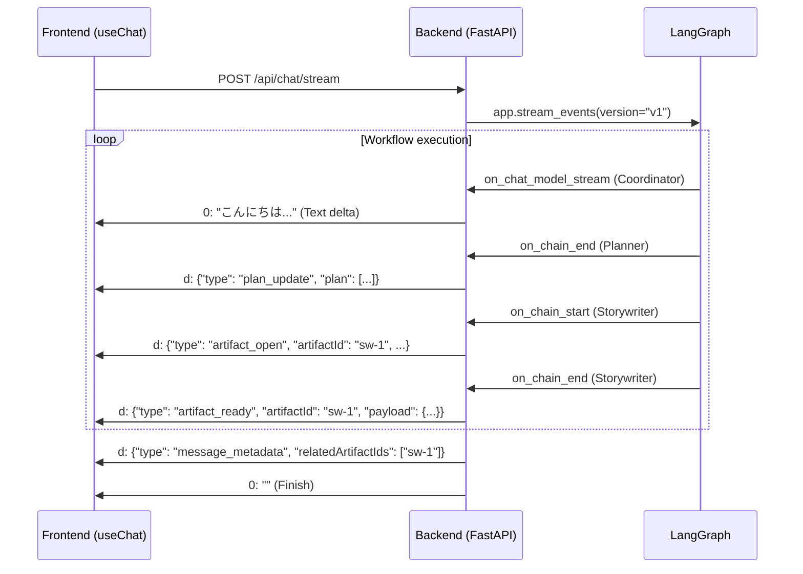

# 03. ストリーミング・プロトコル (SSE)

本システムは、Vercel AI SDK v6 **Data Stream Protocol** に準拠した Server-Sent Events (SSE) を使用して情報を配信します。

## 1. 原則
- **Prefix-based Streaming**: 全ての出力は `prefix:payload\n` の形式で送信されます。
- **Multi-Channel**: `0:` (Text), `d:` (Custom Data), `e:` (Error) 等を使い分け、多様なデータを単一のストリームに統合します。

## 2. カスタム・イベント定義 (`d:` channel)
フロントエンドの UI 状態を制御するため、JSON 形式のカスタム・イベントを発行します。

| `type` | 配信元ノード | 説明 |
| :--- | :--- | :--- |
| `plan_update` | **Planner** | 実行計画の全量を送信。ヘッダーのタスクリストを更新。 |
| `artifact_open` | **Worker (Start)** | 成果物生成の開始を通知。サイドパネルのスケルトンを表示。 |
| `artifact_ready` | **Worker (End)** | 生成完了したデータの実体を送信（Bulk Transfer）。 |
| `log_update` | **Researcher** | 調査の進捗ログ（Glass Box Logs）を送信。 |
| `message_metadata` | **Finalizer** | ターンの最後に送信。メッセージと生成された Artifact ID を紐付け。 |

## 3. シーケンス・ダイアグラム

## 4. プロトコル準拠の重要性
バックエンドの `sse_formatter.py` は、LangGraph のイベントを Vercel AI SDK のプロトコルに正確に変換する責務を負います。
- **Text**: 直接 `0:` プレフィックスで送信。
- **Custom Data**: `d:` プレフィックスと改行区切りを厳守。

> [!CAUTION]
> JSON ペイロード内に生の改行が含まれると、SSE プロトコルが壊れる可能性があります。必ず JSON 文字列としてシリアライズし、最後に `\n` を付与してください。
