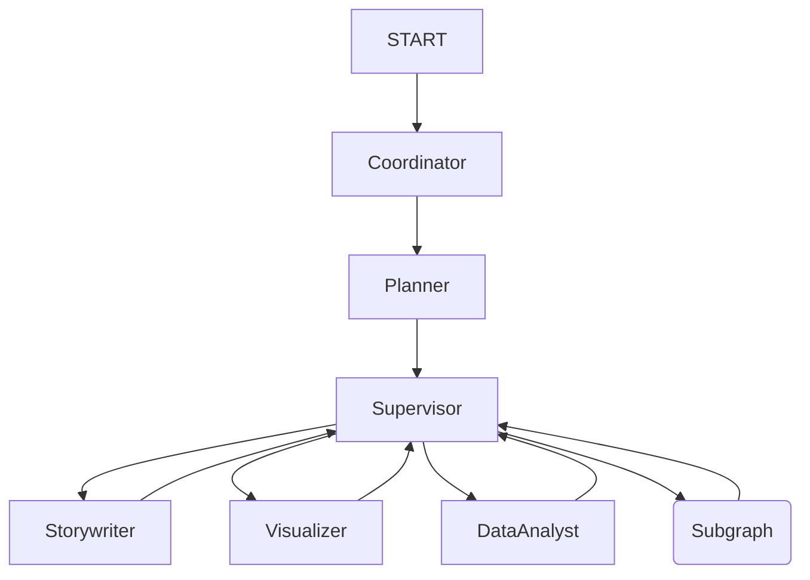

# LangGraph Workflow Technical Documentation

本ドキュメントでは、SpellのLangGraphによるワークフロー実装の詳細について説明します。

---

## 1. State Schema

システム全体の状態は `State` TypedDict で管理されます。これは `langgraph.graph.MessagesState` を拡張しており、チャット履歴（`messages`）を継承しています。

### Global State (`State`)

```python
class State(MessagesState):
    # LangChainの標準的なメッセージ履歴（HumanMessage, AIMessage等）
    # messages: list[AnyMessage] 
    
    # 実行計画リスト
    plan: list[TaskStep]
    
    # 生成された成果物（キー：アーティファクトID、値：JSON文字列）
    artifacts: dict[str, Any]
    
    # PPTXから解析されたデザイン情報（メモリ内保持）
    design_context: DesignContext | None
```

### TaskStep Schema

計画の各ステップを表すオブジェクトです。

```python
class TaskStep(TypedDict):
    id: int                     # ステップ番号
    role: str                   # 担当エージェント (storywriter, visualizer, etc.)
    instruction: str            # 具体的な指示
    description: str            # ステップの概要
    status: Literal["pending", "in_progress", "complete"]
    result_summary: str | None  # 実行結果要約
```

### Researcher Subgraph State

Researcherサブグラフ内でのみ使用される拡張ステートです。

```python
class ResearchSubgraphState(State):
    internal_research_tasks: list[ResearchTask]
    internal_research_results: Annotated[list[ResearchResult], operator.add] # 追記型リスト
    is_decomposed: bool
```

---

## 2. Graph Topology

### Main Graph

メイングラフは以下のノードで構成されています（`src/graph/builder.py` 参照）。

1.  **Coordinator**: `START` から遷移。ユーザー意図を分析し、`Planner` へハンドオフするか、単なる会話として終了するかを決定。
2.  **Planner**: ハンドオフされた場合、タスク計画を作成。
3.  **Supervisor**: 計画（`plan`）を監視し、次に実行すべきステップ（`pending`）の `role` に基づいて Worker へルーティング。
4.  **Workers**: `Storywriter`, `Visualizer`, `DataAnalyst`。タスクを実行し、結果を `State` に書き込んで `Supervisor` へ戻る。
5.  **Researcher (Subgraph)**: 調査タスクの場合、サブグラフを実行して `Supervisor` へ戻る。



### Researcher Subgraph

調査タスクを並列実行するためのMap-Reduceライクなサブグラフです（`src/graph/nodes.py` 参照）。

1.  **Manager**: 調査リクエストを受け取り、複数の検索タスク（`ResearchTask`）に分解して `Worker` へFan-out（並列送信）する。
2.  **Worker**: 各タスクを受け取り、LLM Native Grounding (Google Search) を用いて調査を実行し、結果を `Manager` へ返す。
3.  **Manager (Aggregation)**: 全タスクの結果が集まると、集約してメイングラフの `Supervisor` へ戻る。

---

## 3. Node Details

### Supervisor Logic
`supervisor_node` は計画駆動型のオーケストレーターです。

1.  `plan` をスキャンし、`in_progress` または `pending` のステップを探す。
2.  `in_progress` の場合：成果物（Artifact）の生成を確認し、ステップを `complete` に更新。
3.  `pending` の場合：ステータスを `in_progress` に更新し、担当 Worker へルーティング。
4.  完了確認後、次のステップがあれば再ルーティング、なければ `END` へ遷移。

### Visualizer Logic
`visualizer_node` は高度な画像生成ロジックを持ちます。

*   **Design Direction**: Plannerからの指示と `DesignContext` (テンプレート情報) を組み合わせる。
*   **Template Strategy**: `DesignContext` がある場合、レイアウトに応じた参照画像（Control Image）を自動適用。
*   **Deep Edit**: 既存の `artifacts` がある場合、前回の生成設定（シード値など）を引き継いで一貫性を保つ。

---

## 4. Persistence (Checkpointer)

LangGraph の `checkpointer` 機能を利用して、ステートの永続化と再開（Human-in-the-loop）を実現しています。

*   **Backend**: PostgreSQL (Cloud SQL)
*   **Library**: `langgraph.checkpoint.postgres.aio.AsyncPostgresSaver`
*   **Key**: `thread_id` (セッションID)

ユーザーからのリクエストごとに `thread_id` を指定することで、以前の会話状態（State）をロードし、続きから実行することが可能です。これは `api/app.py` の `ChatRequest` で指定されます。
